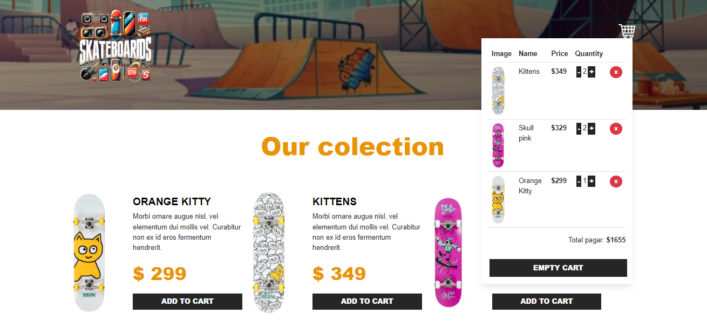

# Skate Shoop

  

## Live Demo

Check out the live demo of the app: [Skate Shop Live](https://skateboard-ariadnaml.netlify.app/)


## Introduction
Skate Shop is a web application for managing and purchasing skateboards and accessories. The app provides a seamless shopping experience with a focus on modern JavaScript and TypeScript practices.  

## Overview
My App is a web application that started as a JavaScript project and was later migrated to TypeScript. Initially, the state management was handled using a custom hook, which was then refactored to use useReducer for better state management.
This project was a learning experience where I implemented shopping cart management using the custom hook and the reducer.

## Features

- **Modern JavaScript and TypeScript**: The project was initially developed in JavaScript and later transitioned to TypeScript for better type safety and developer experience.
- **State Management**: The state management started with a custom hook and was later refactored to use useReducer, providing a more robust and scalable state handling mechanism.
- **Custom Hook**: Originally used to manage the state in a modular and reusable way.
- **useReduce**r: Refactored to useReducer for improved state management and maintainability.

## Technologies Used

- **React**
- **TypeScript**
- **CSS**

## Installation

To run this project locally, follow these steps in the bash:

1. Clone the repository:  
   ```bash
   git clone https://github.com/AriadnaMorenoL/skateboard-ts.git

3. Navigate to the project directory:  
   ```bash
   cd skateboard-ts

5. Install the dependencies:
   ```bash
   npm install

## Usage

- To start the application in development mode:  
  ```bash
  npm start

- To build the application for production:
  ```bash
  npm run build  

# Project structure  

my-app/  
├── public/  
├── src/  
│   ├── components/  
│   ├── data/  
│   ├── hooks/  
│   │   └── useCart.ts // Initial custom hook (deprecated)  
│   ├── reducers/  
│   │   └── cart-Reducer.ts // New reducer implementation  
│   ├── types/  
│   ├── App.tsx  
│   ├── index.tsx  
│   └── ...  
├── package.json  
└── README.md  


